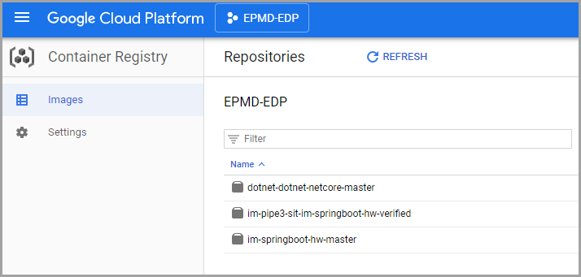

# Google Container Registry Integration

This chapter contains an accurate description of how to use the Google container registry (GCR) for further keeping of the produced by EDP containers.

## Prerequisites
Assuming that cluster is running under the GCP service account, for instance, **712239771395-compute@developer.gserviceaccount.com**
(**cluster_sa**)

## GCR Integration Flow
Discover the steps below to apply the GCR integration correctly:

1. Create a custom role, for instance, **Storage_C1714468**, for the **cluster_sa** with the following permissions:

    * storage.buckets.create
    * storage.buckets.delete
    * storage.buckets.get
    * storage.buckets.list
    * storage.buckets.update
    * storage.objects.create
    * storage.objects.delete
    * storage.objects.get
    * storage.objects.list
    * storage.objects.update
    
    _**NOTE**: Probably, such permissions should be requested from a support team._

2. Grant this role to **cluster_sa** and check that it is assigned:

    
 
    _**NOTE**: Probably, it is necessary to request this assignment via a support team as well._

3. Create a key file and save it with the **kaniko-secret.json** name. To do this, simply navigate to "IAM & Admin -> Service Accounts":
                                                                        
    

     * Find the **cluster_sa**, click the Actions menu and select the Create key option:

      

     * Select the JSON key type and click CREATE:

      
 
   _**NOTE**: Keep it secure in order to be authorized to Kaniko while accessing a Google Container Registry*._

4. Go to the cluster console and create a Secret with the **kaniko-secret** name in the **demo-edp-cicd** namespace from the previous file:
   ```
   kubectl -n demo-edp-cicd create secret generic kaniko-secret --from-file kaniko-secret.json
   ```
5. Create a ConfigMap object with the **kaniko-template** name in the **demo-edp-cicd** namespace by applying the following template:
   
   ```
   apiVersion: v1
   data:
     kaniko.json: |-
       {
         "apiVersion": "v1",
         "kind": "Pod",
         "metadata": {
           "name": "kaniko"
         },
         "spec": {
           "initContainers": [
             {
               "name": "init-kaniko",
               "image": "busybox",
               "command": [
                 "/bin/sh",
                 "-c",
                 "while ! [[ -f /tmp/workspace/Dockerfile ]]; do echo \"Waiting for Dockerfile in workspace...\"; sleep 10;done"
               ],
               "volumeMounts": [
                 {
                   "name": "shared-volume",
                   "mountPath": "/tmp/workspace"
                 }
               ]
             },
           ],
           "containers": [
             {
               "name": "kaniko",
               "image": "gcr.io/kaniko-project/executor:v0.13.0",
               "env": [
                 {
                   "name": "GOOGLE_APPLICATION_CREDENTIALS",
                   "value": "/secret/kaniko-secret.json"
                 }
               ],
               "args": [
                 "--destination=REPLACE_DESTINATION_IMAGE"
               ],
               "volumeMounts": [
                 {
                   "name": "shared-volume",
                   "mountPath": "/workspace"
                 },
                 {
                   "name": "kaniko-secret",
                   "mountPath": "/secret"
                 }
               ]
             }
           ],
           "restartPolicy": "Never",
           "volumes": [
             {
               "name": "shared-volume",
               "emptyDir": {}
             },
             {
               "name": "kaniko-secret",
               "secret": {
                 "secretName": "kaniko-secret"
               }
             }
           ]
         }
       }
   kind: ConfigMap
   metadata:  
     name: kaniko-template 
   ```
6. Before running pipelines, create EDP component that points to the Google Container Registry URL, which will be **gcr.io/<GCP_Project_ID>**. For instance, **gcr.io/or2-msq-epmd-edp-t1iylu**. Use the following template to create EDP component:

   ```
   apiVersion: v1.edp.epam.com/v1alpha1
   kind: EDPComponent
   metadata:
     name: docker-registry
   spec:
     icon: AxNTMuODIwIDEyMS40MDAgMTUyLjMwMyBDIDEyMi43MjAgMTUxLjQ2OSwxMjQuNDA3IDE1MC41MDgsMTI1LjE0OSAxNTAuMTY4IEMgMTI1Ljg5MCAxNDkuODI3LDEyNy4yNDAgMTQ5LjA3NiwxMjguMTQ5IDE0OC40OTggQyAxMjkuMDU3IDE0Ny45MjAsMTMwLjc5MCAxNDYuOTIxLDEzMi4wMDAgMTQ2LjI3NyBDIDEzMy4yMTAgMTQ1LjYzMiwxMzQuNDI3IDE0NC45MjMsMTM0LjcwNSAxNDQuNzAwIEMgMTM1LjIzMiAxNDQuMjc2LDEzNi4wODkgMTQzLjc5MSwxMzkuODMzIDE0MS44MDAgQyAxNDEuMDczIDE0MS4xNDAsMTQyLjUxOSAxNDAuMjA0LDE0My4wNDQgMTM5LjcxOSBMIDE0NC4wMDAgMTM4LjgzOCAxNDQuMDAwIDEyOC40NTIgQyAxNDQuMDAwIDExNS43MTAsMTQzLjkzMyAxMTUuNDg4LDE0MC44MDAgMTE3LjgwMCBNMjU2LjI0MyAxMTcuNDMzIEMgMjU2LjEwOSAxMTcuNzgxLDI1Ni4wMDAgMTIyLjcyNCwyNTYuMDAwIDEyOC40MTcgQyAyNTYuMDAwIDE0MC4yMDMsMjU1Ljc1NSAxMzkuMzUyLDI1OS43NDIgMTQxLjQzNiBDIDI2MC44NDUgMTQyLjAxMywyNjIuMjA4IDE0Mi43ODcsMjYyLjc3MyAxNDMuMTU4IEMgMjY0LjQyMiAxNDQuMjQwLDI2NS4zMjEgMTQ0Ljc3NSwyNjYuNjAwIDE0NS40MzYgQyAyNjcuMjYwIDE0NS43NzYsMjY4LjUyMCAxNDYuNDkxLDI2OS40MDAgMTQ3LjAyNSBDIDI3MC4yODAgMTQ3LjU1OCwyNzEuNTQwIDE0OC4yNzMsMjcyLjIwMCAxNDguNjEzIEMgMjcyLjg2MCAxNDguOTU0LDI3NC4xMjAgMTQ5LjY2NiwyNzUuMDAwIDE1MC4xOTYgQyAyNzUuODgwIDE1MC43MjUsMjc3LjAxNyAxNTEuMzQ4LDI3Ny41MjcgMTUxLjU4MCBDIDI3OC4wMzcgMTUxLjgxMiwyNzkuMDcyIDE1Mi40NzIsMjc5LjgyNyAxNTMuMDQ4IEwgMjgxLjIwMCAxNTQuMDk1IDI4MS4yMDAgMjAwLjI2MCBDIDI4MS4yMDAgMjQzLjg2NSwyODEuMTYxIDI0Ni40MzksMjgwLjUwMCAyNDYuNjc1IEMgMjgwLjExNSAyNDYuODEyLDI3OS41NTQgMjQ3LjEyMSwyNzkuMjUyIDI0Ny4zNjIgQyAyNzguOTUxIDI0Ny42MDMsMjc3LjU3NCAyNDguNDMwLDI3Ni4xOTEgMjQ5LjIwMCBDIDI3NC44MDggMjQ5Ljk3MCwyNzEuMjE1IDI1Mi4wNDAsMjY4LjIwNyAyNTMuODAwIEMgMjY1LjE5OCAyNTUuNTYwLDI2MS41NDUgMjU3LjY1NSwyNjAuMDg4IDI1OC40NTUgQyAyNTUuNzg3IDI2MC44MTgsMjU2LjAwMCAyNjAuMTI2LDI1Ni4wMDAgMjcxLjc2OCBDIDI1Ni4wMDAgMjg0LjU0OCwyNTUuODYzIDI4NC4yNDksMjYwLjQ2NCAyODEuNDgxIEMgMjYxLjI2OSAyODAuOTk2LDI2Mi43OTkgMjgwLjA5NSwyNjMuODY0IDI3OS40NzkgQyAyNjQuOTI5IDI3OC44NjIsMjY2LjA3MCAyNzguMTk2LDI2Ni40MDAgMjc4LjAwMCBDIDI3MC4xMDMgMjc1Ljc5NSwyNzQuMDYyIDI3My42MDAsMjc0LjMzNSAyNzMuNjAwIEMgMjc0LjUyMiAyNzMuNjAwLDI3NS4wMDIgMjczLjI0MCwyNzUuNDAwIDI3Mi44MDAgQyAyNzUuNzk4IDI3Mi4zNjAsMjc2LjM1NyAyNzIuMDAwLDI3Ni42NDIgMjcyLjAwMCBDIDI3Ni45MjcgMjcyLjAwMCwyNzcuOTM0IDI3MS40OTEsMjc4Ljg4MCAyNzAuODY4IEMgMjgxLjc1OSAyNjguOTc0LDI4My4zMzcgMjY4LjAzNiwyODQuNzQ5IDI2Ny4zNzcgQyAyODUuNDkwIDI2Ny4wMzIsMjg2Ljg0MCAyNjYuMjcyLDI4Ny43NDkgMjY1LjY4OSBDIDI4OS43MjMgMjY0LjQyMywyOTAuNzYzIDI2My44MjgsMjk0LjA4MyAyNjIuMDYyIEMgMjk1LjQ2OCAyNjEuMzI2LDI5Ni44NzAgMjYwLjUwNiwyOTcuMjAwIDI2MC4yMzkgQyAyOTcuNTMwIDI1OS45NzMsMjk4LjI5NSAyNTkuNTQ0LDI5OC45MDAgMjU5LjI4NiBMIDMwMC4wMDAgMjU4LjgxNyAzMDAuMDAwIDIwMC4wMTIgTCAzMDAuMDAwIDE0MS4yMDYgMjk4LjYwOCAxNDAuNTAzIEMgMjk3LjQ4OCAxMzkuOTM3LDI4NS41OTIgMTMzLjA1OSwyODMuMjAwIDEzMS41OTQgQyAyODIuODcwIDEzMS4zOTIsMjgwLjkyMiAxMzAuMjc1LDI3OC44NzEgMTI5LjExMyBDIDI3Ni44MjAgMTI3Ljk1MSwyNzQuNDgwIDEyNi42MDcsMjczLjY3MSAxMjYuMTI3IEMgMjcyLjg2MiAxMjUuNjQ4LDI3MS42NjAgMTI0Ljk3MywyNzEuMDAwIDEyNC42MjggQyAyNzAuMzQwIDEyNC4yODQsMjY5LjI2MCAxMjMuNjUwLDI2OC42MDAgMTIzLjIyMSBDIDI2Ny45NDAgMTIyLjc5MiwyNjYuMzIwIDEyMS44NzQsMjY1LjAwMCAxMjEuMTgyIEMgMjYzLjY4MCAxMjAuNDkwLDI2Mi4zMTYgMTE5LjY3MSwyNjEuOTY5IDExOS4zNjIgQyAyNjEuNjIxIDExOS4wNTMsMjYxLjE2MSAxMTguODAwLDI2MC45NDYgMTE4LjgwMCBDIDI2MC43MzEgMTE4LjgwMCwyNTkuOTQ1IDExOC4zNTAsMjU5LjIwMCAxMTcuODAwIEMgMjU3LjY0NSAxMTYuNjUyLDI1Ni41OTIgMTE2LjUyMiwyNTYuMjQzIDExNy40MzMgTTE0My41OTQgMTI4LjIzMCBDIDE0My42MDEgMTM5Ljc1MiwxNDMuODk1IDEzOC44NDAsMTM5LjM5OCAxNDEuMjMwIEMgMTM4LjA3OSAxNDEuOTMxLDEzNi45MTAgMTQyLjYyNiwxMzYuODAwIDE0Mi43NzUgQyAxMzYuNjkwIDE0Mi45MjQsMTM2LjAxNSAxNDMuMjgyLDEzNS4zMDAgMTQzLjU3MSBDIDEzNC41ODUgMTQzLjg2MCwxMzQuMDAwIDE0NC4yNTUsMTM0LjAwMCAxNDQuNDQ5IEMgMTM0LjAwMCAxNDQuNjQyLDEzMy43NzUgMTQ0LjgwMSwxMzMuNTAwIDE0NC44MDIgQyAxMzMuMjI1IDE0NC44MDMsMTMyLjAxMCAxNDUuNDI2LDEzMC44MDAgMTQ2LjE4NiBDIDEyOS41OTAgMTQ2Ljk0NywxMjguMDYwIDE0Ny44NDgsMTI3LjQwMCAxNDguMTg4IEMgMTI2Ljc0MCAxNDguNTI4LDEyNS40ODAgMTQ5LjI0NSwxMjQuNjAwIDE0OS43ODIgQyAxMjMuNzIwIDE1MC4zMTksMTIyLjU4MyAxNTAuOTQ4LDEyMi4wNzMgMTUxLjE4MCBDIDEyMS41NjMgMTUxLjQxMiwxMjAuNTI4IDE1Mi4wNzIsMTE5Ljc3MyAxNTIuNjQ4IEwgMTE4LjQwMCAxNTMuNjk1IDExOC40MDYgMTk5Ljk0NyBDIDExOC40MDkgMjI1LjM4NiwxMTguNTQ0IDI0Ni4zODAsMTE4LjcwNiAyNDYuNjAwIEMgMTE5LjE0NiAyNDcuMTk5LDEyMS41MTEgMjQ4LjgwMCwxMjEuOTU1IDI0OC44MDAgQyAxMjIuMTY4IDI0OC44MDAsMTIyLjU4MSAyNDkuMDI1LDEyMi44NzEgMjQ5LjMwMCBDIDEyMy4xNjIgMjQ5LjU3NSwxMjQuMDMwIDI1MC4xMTcsMTI0LjgwMCAyNTAuNTA1IEMgMTI1LjU3MCAyNTAuODkyLDEyNi43NDAgMjUxLjU2OCwxMjcuNDAwIDI1Mi4wMDYgQyAxMjguMDYwIDI1Mi40NDMsMTI5LjE0MCAyNTMuMDg0LDEyOS44MDAgMjUzLjQyOCBDIDEzMC40NjAgMjUzLjc3MywxMzEuNzIwIDI1NC40OTEsMTMyLjYwMCAyNTUuMDI1IEMgMTMzLjQ4MCAyNTUuNTU4LDEzNC43NDAgMjU2LjI3MywxMzUuNDAwIDI1Ni42MTMgQyAxMzYuMDYwIDI1Ni45NTQsMTM3LjMyMCAyNTcuNjY2LDEzOC4yMDAgMjU4LjE5NiBDIDEzOS4wODAgMjU4LjcyNSwxNDAuMTkzIDI1OS4zMzksMTQwLjY3NCAyNTkuNTYwIEMgMTQxLjE1NSAyNTkuNzgwLDE0Mi4wMTAgMjYwLjM2MiwxNDIuNTc0IDI2MC44NTIgTCAxNDMuNjAwIDI2MS43NDQgMTQzLjU5NCAyNzEuNzcyIEMgMTQzLjU4NyAyODIuNjkzLDE0My40OTQgMjgzLjI2MSwxNDEuOTE2IDI4Mi4wMjAgQyAxNDEuMzU0IDI4MS41NzgsMTQwLjQ2OCAyODEuMDIzLDEzOS45NDcgMjgwLjc4NyBDIDEzOS40MjYgMjgwLjU1MiwxMzguMjgwIDI3OS45MjIsMTM3LjQwMCAyNzkuMzg3IEMgMTM2LjUyMCAyNzguODUzLDEzNS4zNTAgMjc4LjE5MSwxMzQuODAwIDI3Ny45MTcgQyAxMzQuMjUwIDI3Ny42NDMsMTMyLjk0NyAyNzYuODI5LDEzMS45MDQgMjc2LjEwOSBDIDEzMC44NjEgMjc1LjM4OSwxMjkuNzU4IDI3NC44MDAsMTI5LjQ1MyAyNzQuODAwIEMgMTI5LjE0OCAyNzQuODAwLDEyOC42ODIgMjc0LjUzOSwxMjguNDE3IDI3NC4yMjAgQyAxMjguMTUyIDI3My45MDIsMTI3LjMyMCAyNzMuNDM4LDEyNi41NjggMjczLjE4OSBDIDEyNS44MTYgMjcyLjk0MSwxMjUuMjAwIDI3Mi41NjcsMTI1LjIwMCAyNzIuMzU5IEMgMTI1LjIwMCAyNzIuMTUxLDEyNC43MjIgMjcxLjc5OCwxMjQuMTM3IDI3MS41NzYgQyAxMjMuNTUzIDI3MS4zNTQsMTIyLjI4NyAyNzAuNjQwLDEyMS4zMjMgMjY5Ljk5MCBDIDEyMC4zNjAgMjY5LjM0MCwxMTkuMTQyIDI2OC43MDAsMTE4LjYxNSAyNjguNTY4IEMgMTE4LjA4OSAyNjguNDM2LDExNy4zNDggMjY3Ljk4NCwxMTYuOTY3IDI2Ny41NjQgQyAxMTYuNTg3IDI2Ny4xNDQsMTE2LjAzMiAyNjYuODAwLDExNS43MzQgMjY2LjgwMCBDIDExNS40MzYgMjY2LjgwMCwxMTQuMzM5IDI2Ni4yMTEsMTEzLjI5NiAyNjUuNDkxIEMgMTEyLjI1MyAyNjQuNzcxLDExMC45NTAgMjYzLjk2MiwxMTAuNDAwIDI2My42OTQgQyAxMDkuODUwIDI2My40MjUsMTA5LjEzMCAyNjMuMDMxLDEwOC44MDAgMjYyLjgxNyBDIDEwOC4xOTIgMjYyLjQyMywxMDQuNzQwIDI2MC40NjUsMTAyLjA2NCAyNTguOTk3IEwgMTAwLjYwMCAyNTguMTkzIDEwMC40OTAgMjAwLjc5NyBDIDEwMC4zNzEgMTM4LjE1NSwxMDAuMjcxIDE0MS44NTksMTAyLjEwNyAxNDEuMDAwIEMgMTAyLjgxOCAxNDAuNjY3LDEwNC4xMjAgMTM5Ljk1MiwxMDUuMDAwIDEzOS40MTEgQyAxMDUuODgwIDEzOC44NzEsMTA3LjE0MCAxMzguMTQ5LDEwNy44MDAgMTM3LjgwOCBDIDEwOS4zMjUgMTM3LjAyMCwxMTAuMDY0IDEzNi41NzMsMTEyLjkxMyAxMzQuNzExIEMgMTE0LjE4NCAxMzMuODgwLDExNS40OTEgMTMzLjIwMCwxMTUuODE2IDEzMy4yMDAgQyAxMTYuMTQyIDEzMy4yMDAsMTE2LjcxNiAxMzIuODQwLDExNy4wOTMgMTMyLjQwMCBDIDExNy40NzAgMTMxLjk2MCwxMTguMDUzIDEzMS41OTUsMTE4LjM4OSAxMzEuNTg5IEMgMTE4LjcyNSAxMzEuNTgyLDEyMC4wNzYgMTMwLjg2MiwxMjEuMzkxIDEyOS45ODkgQyAxMjIuNzA3IDEyOS4xMTUsMTI0LjAwMyAxMjguNDAwLDEyNC4yNzIgMTI4LjQwMCBDIDEyNC41NDAgMTI4LjQwMCwxMjQuOTA0IDEyOC4xNzUsMTI1LjA4MCAxMjcuOTAwIEMgMTI1LjI1NiAxMjcuNjI1LDEyNi4wMzAgMTI3LjA3NiwxMjYuODAwIDEyNi42ODAgQyAxMjkuNDc2IDEyNS4zMDMsMTMwLjYwOSAxMjQuNjY2LDEzMi4yMDAgMTIzLjY0MCBDIDEzMy4wODAgMTIzLjA3MywxMzQuMjUwIDEyMi4zODMsMTM0LjgwMCAxMjIuMTA3IEMgMTM2LjU1OCAxMjEuMjI0LDE0MS4wMTggMTE4LjYyNCwxNDIuMDA1IDExNy45MDYgQyAxNDMuNDk5IDExNi44MjEsMTQzLjU4NyAxMTcuMzkzLDE0My41OTQgMTI4LjIzMCBNMjU4LjIyNSAxMTguMDQxIEMgMjU4LjM3NSAxMTguMjgzLDI1OS4wNjEgMTE4Ljc0NiwyNTkuNzQ5IDExOS4wNjggQyAyNjAuNDM3IDExOS4zOTEsMjYxLjcyMCAxMjAuMDkxLDI2Mi42MDAgMTIwLjYyNCBDIDI2My40ODAgMTIxLjE1NywyNjQuNjUwIDEyMS44MjIsMjY1LjIwMCAxMjIuMTAxIEMgMjY1Ljc1MCAxMjIuMzgxLDI2Ni45OTAgMTIzLjEyMCwyNjcuOTU2IDEyMy43NDUgQyAyNjguOTIyIDEyNC4zNzAsMjcwLjIyNyAxMjUuMDYwLDI3MC44NTYgMTI1LjI3OSBDIDI3MS40ODUgMTI1LjQ5OSwyNzIuMDAwIDEyNS44MjcsMjcyLjAwMCAxMjYuMDA4IEMgMjcyLjAwMCAxMjYuMTkwLDI3Mi42MzAgMTI2LjU0NiwyNzMuNDAwIDEyNi44MDAgQyAyNzQuMTcwIDEyNy4wNTQsMjc0LjgwMCAxMjcuNDA1LDI3NC44MDAgMTI3LjU3OSBDIDI3NC44MDAgMTI3Ljc1NCwyNzUuOTg1IDEyOC41MDQsMjc3LjQzMyAxMjkuMjQ3IEMgMjc4Ljg4MSAxMjkuOTkwLDI4MC4yNTMgMTMwLjgyMywyODAuNDgyIDEzMS4wOTkgQyAyODAuNzExIDEzMS4zNzQsMjgxLjIwOCAxMzEuNjAwLDI4MS41ODcgMTMxLjYwMCBDIDI4MS45NjYgMTMxLjYwMCwyODIuNjAyIDEzMS45NjAsMjgzLjAwMCAxMzIuNDAwIEMgMjgzLjM5OCAxMzIuODQwLDI4My45NjggMTMzLjIwMCwyODQuMjY2IDEzMy4yMDAgQyAyODQuNTY0IDEzMy4yMDAsMjg1LjcxNiAxMzMuODM4LDI4Ni44MjYgMTM0LjYxOCBDIDI4Ny45MzYgMTM1LjM5OCwyODkuMjM5IDEzNi4yMDgsMjg5LjcyMiAxMzYuNDE3IEMgMjkwLjIwNSAxMzYuNjI3LDI5MC44NzAgMTM2Ljk3MiwyOTEuMjAwIDEzNy4xODUgQyAyOTEuODEyIDEzNy41ODAsMjk1LjI5OCAxMzkuNTU2LDI5Ny45MzYgMTQxLjAwMyBMIDI5OS40MDAgMTQxLjgwNyAyOTkuNDAwIDIwMC4wMDAgTCAyOTkuNDAwIDI1OC4xOTMgMjk3LjgwMCAyNTkuMDg4IEMgMjk2LjkyMCAyNTkuNTgwLDI5NS42MTUgMjYwLjI5MCwyOTQuOTAwIDI2MC42NjYgQyAyOTQuMTg1IDI2MS4wNDEsMjkzLjYwMCAyNjEuNDk1LDI5My42MDAgMjYxLjY3NCBDIDI5My42MDAgMjYxLjg1MywyOTMuMzk2IDI2Mi4wMDAsMjkzLjE0NyAyNjIuMDAwIEMgMjkyLjc1NyAyNjIuMDAwLDI4OS4zNjQgMjYzLjg5NCwyODQuMDU3IDI2Ny4wNzMgQyAyODMuMjU1IDI2Ny41NTIsMjgyLjA2MCAyNjguMjI3LDI4MS40MDAgMjY4LjU3MiBDIDI4MC43NDAgMjY4LjkxNiwyNzkuNjYwIDI2OS41NTksMjc5LjAwMCAyNzAuMDAwIEMgMjc4LjM0MCAyNzAuNDQxLDI3Ny4xODkgMjcxLjA4NSwyNzYuNDQyIDI3MS40MzEgQyAyNzUuNjk1IDI3MS43NzYsMjc0LjgyNyAyNzIuMzE2LDI3NC41MTMgMjcyLjYzMCBDIDI3NC4xOTkgMjcyLjk0MywyNzMuNjk5IDI3My4yMDAsMjczLjQwMCAyNzMuMjAwIEMgMjczLjEwMSAyNzMuMjAwLDI3Mi42MDEgMjczLjQ1NywyNzIuMjg3IDI3My43NzAgQyAyNzEuOTczIDI3NC4wODQsMjcxLjEwNSAyNzQuNjI0LDI3MC4zNTggMjc0Ljk2OSBDIDI2OS42MTEgMjc1LjMxNSwyNjguNDYwIDI3NS45NTksMjY3LjgwMCAyNzYuNDAwIEMgMjY3LjE0MCAyNzYuODQxLDI2Ni4wNjAgMjc3LjQ3OSwyNjUuNDAwIDI3Ny44MTcgQyAyNjQuNzQwIDI3OC4xNTYsMjYzLjQ4MCAyNzguODYzLDI2Mi42MDAgMjc5LjM4OSBDIDI2MS43MjAgMjc5LjkxNSwyNjAuNDM3IDI4MC42MDksMjU5Ljc0OSAyODAuOTMyIEMgMjU5LjA2MSAyODEuMjU0LDI1OC4zNzUgMjgxLjcxNywyNTguMjI1IDI4MS45NTkgQyAyNTcuMDEyIDI4My45MjIsMjU2LjgwMCAyODIuNDEwLDI1Ni44MDAgMjcxLjgxNyBMIDI1Ni44MDAgMjYxLjIzNCAyNTguNzAwIDI2MC4xMzYgQyAyNTkuNzQ1IDI1OS41MzIsMjYwLjY5MCAyNTguOTM2LDI2MC44MDAgMjU4LjgxMSBDIDI2MC45MTAgMjU4LjY4NiwyNjEuNDUwIDI1OC4zNTksMjYyLjAwMCAyNTguMDg0IEMgMjYyLjU1MCAyNTcuODA5LDI2My43MjAgMjU3LjE1MCwyNjQuNjAwIDI1Ni42MjAgQyAyNjUuNDgwIDI1Ni4wODksMjY2Ljc0MCAyNTUuMzcxLDI2Ny40MDAgMjU1LjAyNSBDIDI2OC4wNjAgMjU0LjY3OCwyNjkuMzIwIDI1My45NTMsMjcwLjIwMCAyNTMuNDEzIEMgMjcxLjA4MCAyNTIuODczLDI3Mi4yOTUgMjUyLjIyNywyNzIuOTAwIDI1MS45NzcgQyAyNzMuNTA1IDI1MS43MjYsMjc0LjAwMCAyNTEuMzczLDI3NC4wMDAgMjUxLjE5MiBDIDI3NC4wMDAgMjUxLjAxMCwyNzQuNjMwIDI1MC42NTQsMjc1LjQwMCAyNTAuNDAwIEMgMjc2LjE3MCAyNTAuMTQ2LDI3Ni44MDAgMjQ5Ljc4NiwyNzYuODAwIDI0OS42MDAgQyAyNzYuODAwIDI0OS40MTQsMjc3LjQzMCAyNDkuMDU0LDI3OC4yMDAgMjQ4LjgwMCBDIDI3OC45NzAgMjQ4LjU0NiwyNzkuNjAwIDI0OC4yMDEsMjc5LjYwMCAyNDguMDMzIEMgMjc5LjYwMCAyNDcuODY2LDI4MC4wNTAgMjQ3LjUyMywyODAuNjAwIDI0Ny4yNzMgTCAyODEuNjAwIDI0Ni44MTcgMjgxLjYwMCAyMDAuMjc2IEwgMjgxLjYwMCAxNTMuNzM0IDI4MC4wMjMgMTUyLjQ2NyBDIDI3OS4xNTYgMTUxLjc3MCwyNzguMTYxIDE1MS4yMDAsMjc3LjgxMSAxNTEuMjAwIEMgMjc3LjQ2MSAxNTEuMjAwLDI3Ny4wNzYgMTUwLjk0MSwyNzYuOTU0IDE1MC42MjQgQyAyNzYuODMzIDE1MC4zMDgsMjc2LjIxMCAxNDkuOTM0LDI3NS41NzEgMTQ5Ljc5NCBDIDI3NC45MzIgMTQ5LjY1MywyNzQuMzA5IDE0OS4zNzcsMjc0LjE4NyAxNDkuMTc5IEMgMjc0LjA2NSAxNDguOTgxLDI3Mi43ODUgMTQ4LjE0MCwyNzEuMzQzIDE0Ny4zMTAgQyAyNjkuOTAxIDE0Ni40NzksMjY4LjA2NCAxNDUuNDA3LDI2Ny4yNjEgMTQ0LjkyNyBDIDI2Ni40NTcgMTQ0LjQ0OCwyNjUuMjYwIDE0My43NzEsMjY0LjYwMCAxNDMuNDI1IEMgMjYzLjk0MCAxNDMuMDc4LDI2Mi42ODAgMTQyLjM1NSwyNjEuODAwIDE0MS44MTggQyAyNjAuOTIwIDE0MS4yODEsMjU5LjgwOCAxNDAuNjYxLDI1OS4zMjkgMTQwLjQ0MiBDIDI1Ni43MTcgMTM5LjI0MywyNTYuODAwIDEzOS42NDksMjU2LjgwMCAxMjguMTExIEMgMjU2LjgwMCAxMTcuNTkyLDI1Ny4wMTQgMTE2LjA4MSwyNTguMjI1IDExOC4wNDEgTTE5Ni42MDAgMTM1LjAxOSBDIDE5NS4wNjAgMTM1Ljk4NywxOTMuNTMwIDEzNi45MDUsMTkzLjIwMCAxMzcuMDU5IEMgMTkyLjg3MCAxMzcuMjEzLDE5MC4zODkgMTM4LjYxMywxODcuNjg4IDE0MC4xNjkgQyAxODQuOTg2IDE0MS43MjYsMTgyLjE5NiAxNDMuMzE5LDE4MS40ODggMTQzLjcxMCBDIDE4MC43NzkgMTQ0LjEwMCwxNzkuNjYwIDE0NC43NzUsMTc5LjAwMCAxNDUuMjA5IEMgMTc4LjM0MCAxNDUuNjQzLDE3Ny4zMDEgMTQ2LjE5NywxNzYuNjkyIDE0Ni40NDEgQyAxNzQuODQ4IDE0Ny4xNzgsMTc0LjgwMCAxNDcuNTg4LDE3NC44MDUgMTYyLjI3NCBDIDE3NC44MTEgMTc3LjA5MiwxNzQuODY5IDE3Ny44NDEsMTc2LjAzOCAxNzguMjEyIEMgMTc2Ljc1MSAxNzguNDM4LDE3OC42NzUgMTc5LjUwNiwxODEuOTM5IDE4MS40ODYgQyAxODIuNzQzIDE4MS45NzMsMTgzLjk0MCAxODIuNjUzLDE4NC42MDAgMTgyLjk5NyBDIDE4NS4yNjAgMTgzLjM0MSwxODYuNTIwIDE4NC4wNjgsMTg3LjQwMCAxODQuNjEzIEMgMTg4LjI4MCAxODUuMTU4LDE4OS43MjAgMTg2LjAwMiwxOTAuNjAwIDE4Ni40ODggQyAxOTEuNDgwIDE4Ni45NzUsMTkyLjQ5OSAxODcuNTU5LDE5Mi44NjUgMTg3Ljc4NiBDIDE5OS4yNTMgMTkxLjc2MywyMDAuODM5IDE5Mi4xNDMsMjAzLjE0OCAxOTAuMjQ5IEMgMjAzLjQ0OSAxOTAuMDAyLDIwNC44MjYgMTg5LjE3MCwyMDYuMjA5IDE4OC40MDAgQyAyMDcuNTkxIDE4Ny42MzAsMjEwLjU1OCAxODUuOTIwLDIxMi44MDEgMTg0LjYwMCBDIDIxOS4yMDAgMTgwLjgzNCwyMjAuNDU5IDE4MC4xMTQsMjIyLjY3MSAxNzguOTUxIEMgMjI1LjMzNSAxNzcuNTUxLDIyNS4xODggMTc4LjU0MywyMjUuMTk1IDE2MS45MDUgTCAyMjUuMjAwIDE0Ny42MTAgMjIzLjY5MyAxNDYuNjU5IEMgMjIyLjg2NCAxNDYuMTM1LDIyMS4xMTUgMTQ1LjEzNiwyMTkuODA3IDE0NC40MzggQyAyMTguNDk4IDE0My43MzksMjE3LjEzNyAxNDIuOTA1LDIxNi43ODIgMTQyLjU4NCBDIDIxNi40MjcgMTQyLjI2MywyMTYuMDA4IDE0Mi4wMDAsMjE1Ljg1MSAxNDIuMDAwIEMgMjE1LjY5NCAxNDIuMDAwLDIxMy40OTMgMTQwLjc4NSwyMTAuOTYwIDEzOS4zMDAgQyAxOTguNzc2IDEzMi4xNTUsMjAwLjM5MCAxMzIuNjM2LDE5Ni42MDAgMTM1LjAxOSBNMjAyLjY2MyAxMzUuMjY0IEMgMjAzLjAxMCAxMzUuNTU5LDIwNC40MjggMTM2LjQzMCwyMDUuODE1IDEzNy4yMDAgQyAyMDcuOTc4IDEzOC40MDEsMjEyLjE0NCAxNDAuODMyLDIxNy45MzIgMTQ0LjI3MyBDIDIxOC43MzkgMTQ0Ljc1MiwyMTkuOTQwIDE0NS40MzQsMjIwLjYwMCAxNDUuNzg3IEMgMjI1LjI0OCAxNDguMjczLDIyNC43ODggMTQ2LjQ3MCwyMjQuNzg4IDE2Mi4yMDAgQyAyMjQuNzg5IDE3Ny42MjMsMjI0LjgyOCAxNzcuMjg0LDIyMi45NzIgMTc3Ljk1NiBDIDIyMi4yMTcgMTc4LjIyOSwyMjEuNjAwIDE3OC42MDEsMjIxLjYwMCAxNzguNzgzIEMgMjIxLjYwMCAxNzguOTY0LDIyMS4xOTUgMTc5LjIxNywyMjAuNzAwIDE3OS4zNDQgQyAyMjAuMjA1IDE3OS40NzEsMjE4LjkwMCAxODAuMTY5LDIxNy44MDAgMTgwLjg5NiBDIDIxNi43MDAgMTgxLjYyMiwyMTQuODEwIDE4Mi43MjksMjEzLjYwMCAxODMuMzU1IEMgMjEyLjM5MCAxODMuOTgxLDIxMS4xNzMgMTg0LjY3NiwyMTAuODk1IDE4NC45MDAgQyAyMTAuMzYzIDE4NS4zMjgsMjA5LjU1OSAxODUuNzg0LDIwNS41NzEgMTg3LjkxNyBDIDIwNC4yMTcgMTg4LjY0MiwyMDIuODQ2IDE4OS40OTcsMjAyLjUyNiAxODkuODE3IEMgMjAxLjQ1MSAxOTAuODkyLDE5OC45NTMgMTkwLjUyMywxOTYuMDcwIDE4OC44NjMgQyAxOTQuNjAxIDE4OC4wMTcsMTkzLjEzMCAxODcuMTk4LDE5Mi44MDAgMTg3LjA0MyBDIDE5Mi40NzAgMTg2Ljg4OSwxOTEuNTQyIDE4Ni4zNjUsMTkwLjczOCAxODUuODgxIEMgMTg1LjkwOCAxODIuOTcxLDE3OS4yMTQgMTc5LjIwMCwxNzguODc4IDE3OS4yMDAgQyAxNzguNjYyIDE3OS4yMDAsMTc4LjM4OCAxNzguOTQ3LDE3OC4yNzAgMTc4LjYzOCBDIDE3OC4xNTEgMTc4LjMyOCwxNzcuNTIyIDE3Ny45NTksMTc2Ljg3MyAxNzcuODE2IEMgMTc1LjIzOCAxNzcuNDU3LDE3NS4yMDAgMTc3LjExMiwxNzUuMjAwIDE2Mi42MDAgQyAxNzUuMjAwIDE0OC40MjMsMTc1LjI2MCAxNDcuODI2LDE3Ni43NDUgMTQ3LjIwOCBDIDE3Ny4zMjUgMTQ2Ljk2NiwxNzguNTIwIDE0Ni4zMjksMTc5LjQwMCAxNDUuNzkyIEMgMTgwLjI4MCAxNDUuMjU1LDE4MS40NTAgMTQ0LjU5NywxODIuMDAwIDE0NC4zMzEgQyAxODIuNTUwIDE0NC4wNjQsMTgzLjI3MCAxNDMuNjI3LDE4My42MDAgMTQzLjM2MSBDIDE4My45MzAgMTQzLjA5NCwxODUuMzMyIDE0Mi4yNzQsMTg2LjcxNyAxNDEuNTM4IEMgMTkwLjg5OCAxMzkuMzE1LDE5MS42MjcgMTM4Ljg5NywxOTIuMzI4IDEzOC4zMjQgQyAxOTIuNjk3IDEzOC4wMjIsMTkzLjgxMCAxMzcuMzQ5LDE5NC44MDAgMTM2LjgyOCBDIDE5NS43OTAgMTM2LjMwNywxOTYuODcwIDEzNS42NjEsMTk3LjIwMCAxMzUuMzkzIEMgMTk4LjU2NCAxMzQuMjgyLDIwMS40MjcgMTM0LjIxNSwyMDIuNjYzIDEzNS4yNjQgTTIzMy4wMTQgMTkyLjc3NyBDIDIzMi44ODYgMTkyLjk4NSwyMzEuMzkwIDE5My45MjksMjI5LjY5MCAxOTQuODc2IEMgMjI3Ljk5MSAxOTUuODIyLDIyNi4zMDkgMTk2Ljc3OCwyMjUuOTU0IDE5Ni45OTggQyAyMjUuNTk5IDE5Ny4yMTksMjI0LjU3NiAxOTcuODAyLDIyMy42ODEgMTk4LjI5NCBDIDIyMi43ODYgMTk4Ljc4NiwyMjEuOTQxIDE5OS4zNzEsMjIxLjgwNCAxOTkuNTk0IEMgMjIxLjY2NiAxOTkuODE3LDIyMS4zMDEgMjAwLjAwMCwyMjAuOTk0IDIwMC4wMDAgQyAyMjAuNTI2IDIwMC4wMDAsMjE4LjgzMiAyMDAuOTY2LDIxNi45NzIgMjAyLjI5NCBDIDIxNi43MzcgMjAyLjQ2MiwyMTUuNTgxIDIwMy4xMTIsMjE0LjQwNSAyMDMuNzM3IEMgMjEzLjIyOCAyMDQuMzYzLDIxMS41NzYgMjA1LjMxMCwyMTAuNzMzIDIwNS44NDIgTCAyMDkuMjAwIDIwNi44MTAgMjA5LjIyOCAyMjEuMTA1IEMgMjA5LjI1OSAyMzYuNjE3LDIwOS4yNTcgMjM2LjYwNSwyMTEuMTA4IDIzNy41NTQgQyAyMTIuMjI5IDIzOC4xMjksMjE4Ljg0NCAyNDEuODUzLDIyMC40MDAgMjQyLjc4NiBDIDIzMi4yNjUgMjQ5Ljg5NywyMzQuNDk5IDI1MC44OTcsMjM2LjI3NSAyNDkuODk0IEMgMjM2Ljc1NiAyNDkuNjIyLDI0MS40ODQgMjQ2Ljg4MCwyNDYuNzgxIDI0My44MDAgQyAyNTIuMDc3IDI0MC43MjAsMjU2Ljk4MyAyMzcuOTA5LDI1Ny42ODEgMjM3LjU1NCBDIDI1OS41NDQgMjM2LjYwNywyNTkuNTQxIDIzNi42MzEsMjU5LjU3MiAyMjEuMDkxIEwgMjU5LjYwMCAyMDYuNzgyIDI1Ny44NTcgMjA1LjY3NyBDIDI1Ni44OTkgMjA1LjA2OSwyNTUuMjM0IDIwNC4xMjgsMjU0LjE1NyAyMDMuNTg2IEMgMjUzLjA4MSAyMDMuMDQ0LDI1Mi4xMTAgMjAyLjUwOCwyNTIuMDAwIDIwMi4zOTYgQyAyNTEuMzc3IDIwMS43NjEsMjQ4LjMzMiAyMDAuMDAwLDI0Ny44NTggMjAwLjAwMCBDIDI0Ny41NTAgMjAwLjAwMCwyNDcuMDY1IDE5OS43MjAsMjQ2Ljc4MSAxOTkuMzc3IEMgMjQ2LjQ5NiAxOTkuMDM0LDI0NS43MDkgMTk4LjQ5NSwyNDUuMDMyIDE5OC4xNzkgQyAyNDQuMzU0IDE5Ny44NjIsMjQzLjI2MCAxOTcuMjY4LDI0Mi42MDAgMTk2Ljg1OCBDIDI0MC45MzggMTk1LjgyNywyMzguNDExIDE5NC4zNzgsMjM3LjEwOCAxOTMuNzA5IEMgMjM2LjUwNyAxOTMuNDAxLDIzNS45MTIgMTkyLjk4MSwyMzUuNzg0IDE5Mi43NzUgQyAyMzUuNDgzIDE5Mi4yODcsMjMzLjMxNiAxOTIuMjg5LDIzMy4wMTQgMTkyLjc3NyBNMjM2LjAzOSAxOTMuODY5IEMgMjM2Ljc4NyAxOTQuMjM2LDIzNy40OTAgMTk0LjY0OCwyMzcuNjAwIDE5NC43ODIgQyAyMzcuNzEwIDE5NC45MTcsMjM5LjAzMCAxOTUuNjUxLDI0MC41MzMgMTk2LjQxMyBDIDI0Mi4wMzYgMTk3LjE3NCwyNDMuNDUzIDE5OC4wMjMsMjQzLjY4MiAxOTguMjk5IEMgMjQzLjkxMSAxOTguNTc0LDI0NC4zMzMgMTk4LjgwMCwyNDQuNjIwIDE5OC44MDAgQyAyNDQuOTA4IDE5OC44MDAsMjQ1LjM5OSAxOTkuMDU3LDI0NS43MTMgMTk5LjM3MCBDIDI0Ni4wMjcgMTk5LjY4NCwyNDYuODk1IDIwMC4yMjQsMjQ3LjY0MiAyMDAuNTY5IEMgMjQ4LjM4OSAyMDAuOTE1LDI0OS41NDAgMjAxLjU1OSwyNTAuMjAwIDIwMi4wMDAgQyAyNTAuODYwIDIwMi40NDEsMjUxLjk0MCAyMDMuMDc5LDI1Mi42MDAgMjAzLjQxNyBDIDI1My4yNjAgMjAzLjc1NiwyNTQuNTIwIDIwNC40NjcsMjU1LjQwMCAyMDQuOTk3IEMgMjU2LjI4MCAyMDUuNTI3LDI1Ny4zOTAgMjA2LjE3MiwyNTcuODY2IDIwNi40MjkgQyAyNjAuNDUxIDIwNy44MjYsMjU5Ljc2OSAyMzcuMjAwLDI1Ny4xNTIgMjM3LjIwMCBDIDI1Ni43MDggMjM3LjIwMCwyNTAuMzA1IDI0MC44MTEsMjUwLjAwMCAyNDEuMjMzIEMgMjQ5Ljg5MCAyNDEuMzg1LDI0OS4xNzAgMjQxLjgwMCwyNDguNDAwIDI0Mi4xNTQgQyAyNDcuNjMwIDI0Mi41MDgsMjQ2LjQ2MCAyNDMuMTU5LDI0NS44MDAgMjQzLjYwMCBDIDI0NS4xNDAgMjQ0LjA0MSwyNDQuMDYwIDI0NC42NzksMjQzLjQwMCAyNDUuMDE3IEMgMjQyLjc0MCAyNDUuMzU2LDI0MS40ODAgMjQ2LjA2MywyNDAuNjAwIDI0Ni41ODkgQyAyMzkuNzIwIDI0Ny4xMTUsMjM4LjQzNyAyNDcuODA5LDIzNy43NDkgMjQ4LjEzMiBDIDIzNy4wNjEgMjQ4LjQ1NCwyMzYuMzc1IDI0OC45MTcsMjM2LjIyNSAyNDkuMTU5IEMgMjM2LjA3NSAyNDkuNDAyLDIzNS4yNTQgMjQ5LjYwMCwyMzQuNDAwIDI0OS42MDAgQyAyMzMuNTQ2IDI0OS42MDAsMjMyLjcyNSAyNDkuNDAyLDIzMi41NzUgMjQ5LjE1OSBDIDIzMi40MjUgMjQ4LjkxNywyMzEuNzM5IDI0OC40NTQsMjMxLjA1MSAyNDguMTMyIEMgMjMwLjM2MyAyNDcuODA5LDIyOS4wODAgMjQ3LjExNSwyMjguMjAwIDI0Ni41ODkgQyAyMjcuMzIwIDI0Ni4wNjMsMjI2LjA2MCAyNDUuMzU2LDIyNS40MDAgMjQ1LjAxNyBDIDIyNC43NDAgMjQ0LjY3OSwyMjMuNjYwIDI0NC4wNDEsMjIzLjAwMCAyNDMuNjAwIEMgMjIyLjM0MCAyNDMuMTU5LDIyMS4xNzAgMjQyLjUwOCwyMjAuNDAwIDI0Mi4xNTQgQyAyMTkuNjMwIDI0MS44MDAsMjE4LjkxMCAyNDEuMzg1LDIxOC44MDAgMjQxLjIzMyBDIDIxOC40OTUgMjQwLjgxMSwyMTIuMDkyIDIzNy4yMDAsMjExLjY0OCAyMzcuMjAwIEMgMjA5Ljc5MSAyMzcuMjAwLDIwOS42MDAgMjM1Ljc2MCwyMDkuNjA1IDIyMS44NDYgQyAyMDkuNjExIDIwNy41MDksMjA5LjY0NCAyMDcuMTI2LDIxMC45MzQgMjA2LjQyOSBDIDIxMS40MTAgMjA2LjE3MiwyMTIuNTIwIDIwNS41MjcsMjEzLjQwMCAyMDQuOTk3IEMgMjE0LjI4MCAyMDQuNDY3LDIxNS41NDAgMjAzLjc1NCwyMTYuMjAwIDIwMy40MTMgQyAyMTYuODYwIDIwMy4wNzMsMjE4LjEyMCAyMDIuMzU4LDIxOS4wMDAgMjAxLjgyNSBDIDIxOS44ODAgMjAxLjI5MSwyMjEuMTQwIDIwMC41NzMsMjIxLjgwMCAyMDAuMjI4IEMgMjIyLjQ2MCAxOTkuODg0LDIyMy41NDAgMTk5LjI0NiwyMjQuMjAwIDE5OC44MTEgQyAyMjUuODEwIDE5Ny43NDksMjI3Ljg5OCAxOTYuNTc0LDIyOS42MDAgMTk1Ljc3MSBDIDIzMC4zNzAgMTk1LjQwNywyMzEuMDkwIDE5NC45NzgsMjMxLjIwMCAxOTQuODE3IEMgMjMxLjQ1NiAxOTQuNDQxLDIzMy42NjMgMTkzLjI5OCwyMzQuMjM5IDE5My4yNDIgQyAyMzQuNDgwIDE5My4yMTksMjM1LjI5MCAxOTMuNTAxLDIzNi4wMzkgMTkzLjg2OSBNMTYzLjI0NSAxOTQuMjU0IEMgMTYyLjczMiAxOTQuNjEzLDE2MS4zMTAgMTk1LjQ0MiwxNjAuMDg2IDE5Ni4wOTUgQyAxNTguODYyIDE5Ni43NDgsMTU3LjYwOSAxOTcuNTM0LDE1Ny4zMDIgMTk3Ljg0MSBDIDE1Ni45OTQgMTk4LjE0OSwxNTYuNDk5IDE5OC40MDAsMTU2LjIwMCAxOTguNDAwIEMgMTU1LjkwMSAxOTguNDAwLDE1NS40MTkgMTk4LjYzMiwxNTUuMTI5IDE5OC45MTUgQyAxNTQuODM4IDE5OS4xOTgsMTUzLjYxMCAxOTkuOTM4LDE1Mi40MDAgMjAwLjU1OSBDIDE1MS4xOTAgMjAxLjE4MSwxNDkuOTMwIDIwMS45MjIsMTQ5LjYwMCAyMDIuMjA3IEMgMTQ5LjA3NSAyMDIuNjU5LDE0Ny4zMzYgMjAzLjYyNiwxNDIuNzE1IDIwNi4wMzQgQyAxNDAuNDUyIDIwNy4yMTQsMTQwLjQyOSAyMDcuMzc0LDE0MC40MjAgMjIyLjIwMCBDIDE0MC40MDkgMjM4LjEzMiwxNDAuMjYxIDIzNy4xOTcsMTQzLjAxOCAyMzguNTkxIEMgMTQ0LjIwMCAyMzkuMTkwLDE0NS4zNzcgMjM5LjkzMSwxNDUuNjMzIDI0MC4yMzkgQyAxNDUuODg5IDI0MC41NDgsMTQ2LjMwNSAyNDAuODAwLDE0Ni41NTggMjQwLjgwMCBDIDE0Ni44MTEgMjQwLjgwMCwxNDcuOTE3IDI0MS4zODUsMTQ5LjAxNiAyNDIuMTAwIEMgMTUwLjExNSAyNDIuODE1LDE1MS42NDEgMjQzLjcyNCwxNTIuNDA3IDI0NC4xMjAgQyAxNTUuMTQwIDI0NS41MzMsMTU2LjIyMiAyNDYuMTQzLDE1Ny44MDAgMjQ3LjE2MCBDIDE1OC42ODAgMjQ3LjcyNywxNTkuODUwIDI0OC40MTksMTYwLjQwMCAyNDguNjk5IEMgMTYwLjk1MCAyNDguOTc4LDE2Mi4xMjAgMjQ5LjY0NywxNjMuMDAwIDI1MC4xODQgQyAxNjUuNDc4IDI1MS42OTgsMTY1LjY2NiAyNTEuNzU5LDE2Ni4zNTQgMjUxLjI2MSBDIDE2Ni43MDkgMjUxLjAwNCwxNjcuNDUwIDI1MC41NzgsMTY4LjAwMCAyNTAuMzE0IEMgMTY4LjkwNiAyNDkuODgwLDE3Mi44OTMgMjQ3LjU5NywxNzYuNzIxIDI0NS4zMjEgQyAxNzcuNTM0IDI0NC44MzcsMTc4LjU2MCAyNDQuMjcyLDE3OS4wMDAgMjQ0LjA2NiBDIDE3OS40NDAgMjQzLjg2MCwxODAuNzg2IDI0My4wNDEsMTgxLjk5MSAyNDIuMjQ2IEMgMTgzLjE5NiAyNDEuNDUxLDE4NC4zOTggMjQwLjgwMCwxODQuNjYyIDI0MC44MDAgQyAxODQuOTI3IDI0MC44MDAsMTg1LjM4MSAyNDAuNTY2LDE4NS42NzEgMjQwLjI4MSBDIDE4NS45NjIgMjM5Ljk5NSwxODcuMjM1IDIzOS4xNzIsMTg4LjUwMCAyMzguNDUxIEwgMTkwLjgwMCAyMzcuMTQxIDE5MC44MDAgMjIyLjY0NyBDIDE5MC44MDAgMjA2Ljg2MSwxOTAuODU1IDIwNy4yNTYsMTg4LjQ2OSAyMDYuMDM5IEMgMTg3LjI4NSAyMDUuNDM1LDE3OC40ODYgMjAwLjM5NywxNzcuMjAwIDE5OS41ODYgQyAxNzYuODcwIDE5OS4zNzksMTc1Ljk3MCAxOTguODQ1LDE3NS4yMDAgMTk4LjQwMCBDIDE3NC40MzAgMTk3Ljk1NSwxNzMuNTMwIDE5Ny40MjMsMTczLjIwMCAxOTcuMjE4IEMgMTY3LjUxMCAxOTMuNjcwLDE2NS4xMDIgMTkyLjk1MywxNjMuMjQ1IDE5NC4yNTQgTTE2Ny4wMjAgMTk0LjQzMyBDIDE2Ny4xNjggMTk0LjY3MSwxNjguMDMzIDE5NS4yMTksMTY4Ljk0NCAxOTUuNjUwIEMgMTcxLjQxNCAxOTYuODIwLDE3Mi45NzYgMTk3LjY4OCwxNzMuMjAwIDE5OC4wMTUgQyAxNzMuMzEwIDE5OC4xNzYsMTc0LjUyMSAxOTguOTEzLDE3NS44OTEgMTk5LjY1NCBDIDE3Ny4yNjEgMjAwLjM5NCwxNzkuMDAyIDIwMS4zNjAsMTc5Ljc1OSAyMDEuODAwIEMgMTgwLjUxNiAyMDIuMjQwLDE4Mi45NDQgMjAzLjY0MiwxODUuMTU0IDIwNC45MTUgQyAxODcuMzY0IDIwNi4xODgsMTg5LjQ0OSAyMDcuNTA2LDE4OS43ODYgMjA3Ljg0MyBDIDE5MC4zMTUgMjA4LjM3MiwxOTAuNDAwIDIxMC40MjYsMTkwLjQwMCAyMjIuNjQ5IEwgMTkwLjQwMCAyMzYuODQxIDE4OS4xMDAgMjM3LjQzMyBDIDE4OC4zODUgMjM3Ljc1OSwxODcuMjYwIDIzOC4zODAsMTg2LjYwMCAyMzguODE0IEMgMTg1Ljk0MCAyMzkuMjQ3LDE4NC44NjAgMjM5Ljg4NCwxODQuMjAwIDI0MC4yMjggQyAxODMuNTQwIDI0MC41NzMsMTgyLjMzOSAyNDEuMjQ4LDE4MS41MzIgMjQxLjcyNyBDIDE4MC43MjQgMjQyLjIwNywxNzguMjA0IDI0My42NzIsMTc1LjkzMiAyNDQuOTgzIEMgMTczLjY1OSAyNDYuMjk0LDE3MS43MTAgMjQ3LjQ3NCwxNzEuNjAwIDI0Ny42MDYgQyAxNzEuNDkwIDI0Ny43MzgsMTcwLjgxNSAyNDguMDgyLDE3MC4xMDAgMjQ4LjM3MSBDIDE2OS4zODUgMjQ4LjY2MCwxNjguODAwIDI0OS4wMTksMTY4LjgwMCAyNDkuMTY4IEMgMTY4LjgwMCAyNDkuNTMxLDE2Ni4zNTEgMjUwLjQwMCwxNjUuMzI3IDI1MC40MDAgQyAxNjQuODc5IDI1MC40MDAsMTYzLjkwMiAyNDkuOTkzLDE2My4xNTYgMjQ5LjQ5NiBDIDE2Mi40MTAgMjQ4Ljk5OSwxNjEuMzUwIDI0OC4zNjEsMTYwLjgwMCAyNDguMDc3IEMgMTYwLjI1MCAyNDcuNzkzLDE1OS4wODAgMjQ3LjEyNywxNTguMjAwIDI0Ni41OTcgQyAxNTcuMzIwIDI0Ni4wNjcsMTU2LjA2MCAyNDUuMzU0LDE1NS40MDAgMjQ1LjAxMyBDIDE1NC43NDAgMjQ0LjY3MywxNTMuNDgwIDI0My45NTQsMTUyLjYwMCAyNDMuNDE2IEMgMTUxLjcyMCAyNDIuODc5LDE1MC41NTAgMjQyLjIwNywxNTAuMDAwIDI0MS45MjQgQyAxNDkuNDUwIDI0MS42NDEsMTQ4Ljc2MiAyNDEuMTgyLDE0OC40NzEgMjQwLjkwNSBDIDE0OC4xODEgMjQwLjYyNywxNDcuNjk5IDI0MC40MDAsMTQ3LjQwMCAyNDAuNDAwIEMgMTQ3LjEwMSAyNDAuNDAwLDE0Ni42MTggMjQwLjE2MSwxNDYuMzI1IDIzOS44NjggQyAxNDUuNzU2IDIzOS4yOTksMTQ0LjA4OCAyMzguMzI2LDE0Mi4zMDAgMjM3LjUyMCBMIDE0MS4yMDAgMjM3LjAyNSAxNDEuMjAwIDIyMi41NDEgTCAxNDEuMjAwIDIwOC4wNTggMTQyLjI1NCAyMDcuMjI5IEMgMTQyLjgzNCAyMDYuNzczLDE0My40OTQgMjA2LjQwMCwxNDMuNzIyIDIwNi40MDAgQyAxNDMuOTUwIDIwNi40MDAsMTQ0LjQyMSAyMDYuMTUwLDE0NC43NjkgMjA1Ljg0NSBDIDE0NS4xMTYgMjA1LjUzOSwxNDYuMzkwIDIwNC43ODQsMTQ3LjYwMCAyMDQuMTY2IEMgMTQ4LjgxMCAyMDMuNTQ4LDE0OS45MzMgMjAyLjgyOCwxNTAuMDk1IDIwMi41NjYgQyAxNTAuMjU3IDIwMi4zMDQsMTUwLjgyNSAyMDEuOTgwLDE1MS4zNTcgMjAxLjg0NiBDIDE1MS44ODkgMjAxLjcxMywxNTMuMjgyIDIwMC45NzMsMTU0LjQ1MyAyMDAuMjAyIEMgMTU1LjYyNCAxOTkuNDMxLDE1Ni43ODkgMTk4LjgwMCwxNTcuMDQyIDE5OC44MDAgQyAxNTcuMjk1IDE5OC44MDAsMTU3LjcxMSAxOTguNTQ4LDE1Ny45NjcgMTk4LjIzOSBDIDE1OC4yMjMgMTk3LjkzMSwxNTkuNDYwIDE5Ny4xNzIsMTYwLjcxNiAxOTYuNTUyIEMgMTYxLjk3MiAxOTUuOTMzLDE2My40MjkgMTk1LjEwNSwxNjMuOTU0IDE5NC43MTMgQyAxNjUuMDE5IDE5My45MTcsMTY2LjYxMiAxOTMuNzcxLDE2Ny4wMjAgMTk0LjQzMyAiIHN0cm9rZT0ibm9uZSIgZmlsbD0iIzljYmNmNCIgZmlsbC1ydWxlPSJldmVub2RkIj48L3BhdGg+PC9nPjwvc3ZnPg==
     type: docker-registry
     url: gcr.io/or2-msq-epmd-edp-t1iylu
   ```
7. As a result, the built images will be displayed in the Container Registry section of the GCP Web console:

    